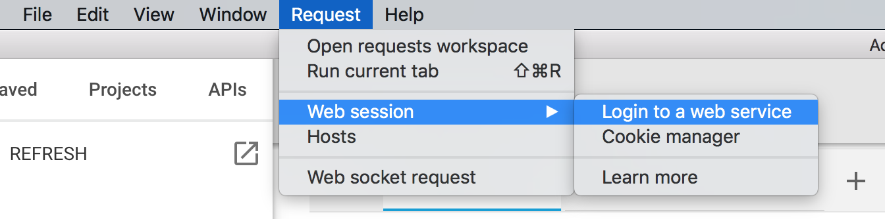
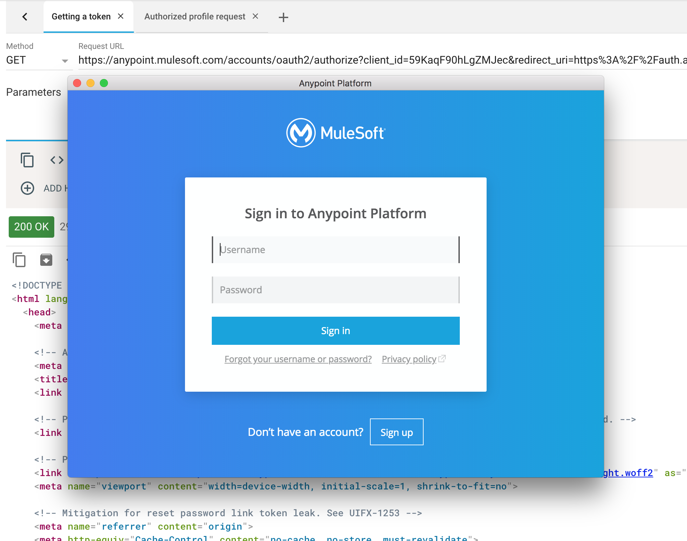
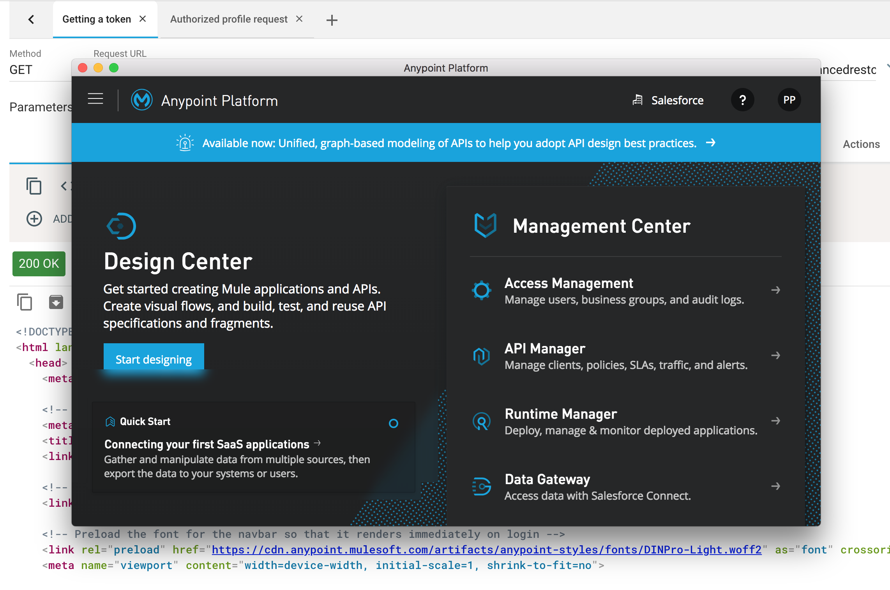
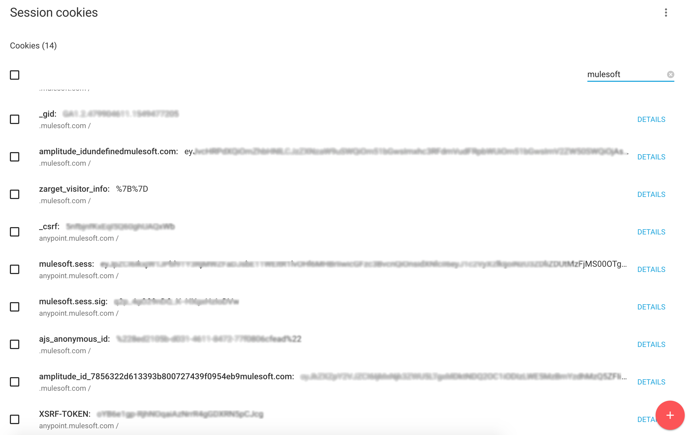
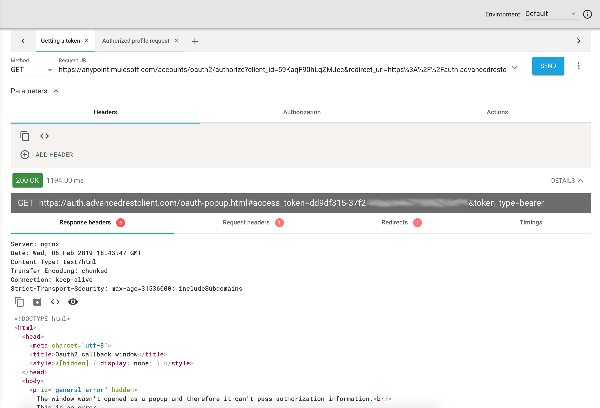
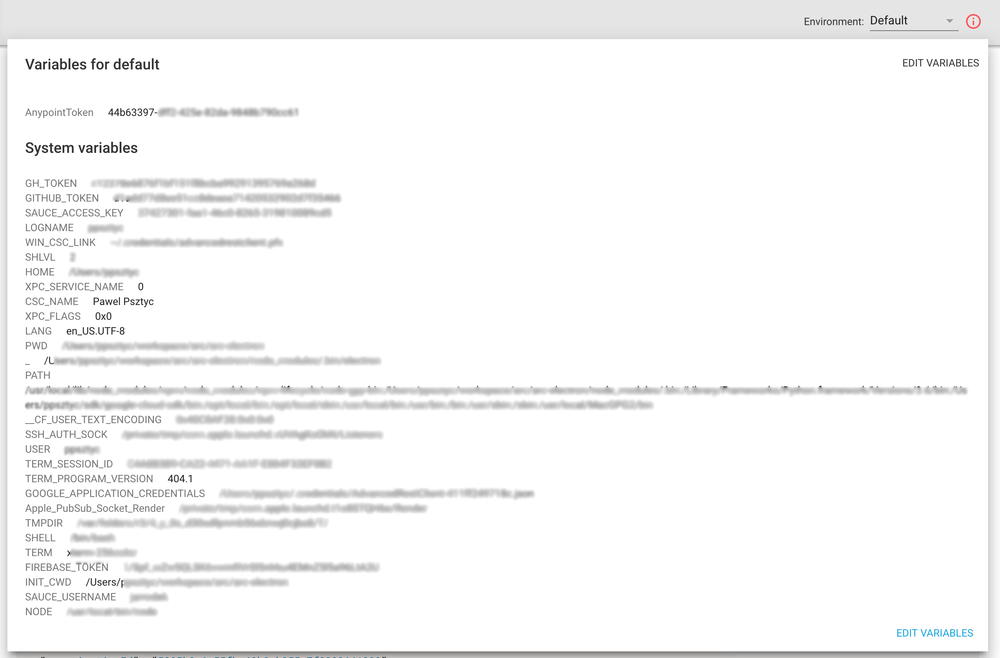
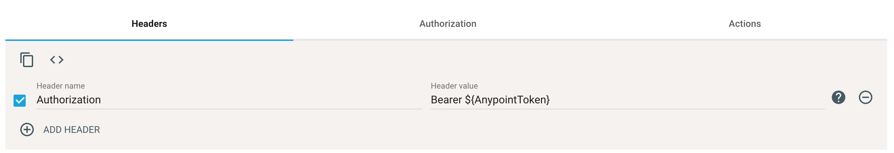
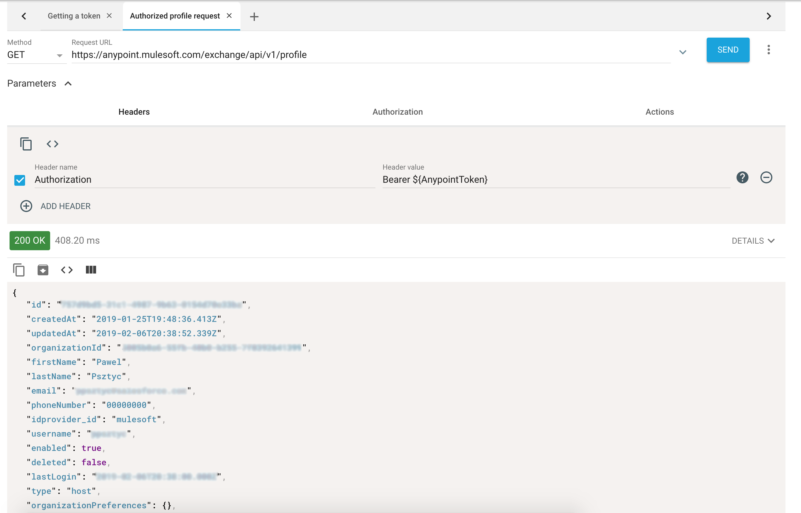

# Authenticating With OAuth2 And Request Actions

It become challenging for REST testing tools to authenticate the user when OAuth2 authorization scheme is applied to an API. OAuth 2 is a multi-step process that requires user input, valid session on the authorization server, and transferring response data from a response to another request. Advanced REST Client has request actions and cookie sessions that allows to automate this process so you will spend less time managing sessions and tokens, and do more with APIs.

In short summary, OAuth2 requires you to have a valid session on the authentication server, then you have to obtain authorization token using one of predefined or custom authorization methods \(token grant type\). The token has to be used in a request that requires authenticated user, usually by putting it into _Authorization_ header \(_access\_token_ query parameter is also used instead of the header\). This article focuses on obtaining implicit grant type token \(I am calling it browser flow because it doesn’t require server component and is designed to work in browsers only\) and then using the token in another request without copy/paste the token all the time.

The first thing we need is to setup a session on authorization server. Without it the token request end up being redirected to a login page and therefore the ARC would render this page in response instead of getting token value. Let’s say I want to make a query to Anypoint Exchange to list my API assets. Normally I would go to [https://www.mulesoft.com/exchange/](https://www.mulesoft.com/exchange/) and log in. Then I would browse the asset in Exchange’s UI. But now I would like to query for my REST APIs assets using the API. To do so we have to setup a session inside ARC application. Open the application and from application menu select Request &gt; Web session &gt;Login to a web service. This brings a prompt to enter the URL of the service.

Now we enter Exchange’s url \([https://www.mulesoft.com/exchange/](https://www.mulesoft.com/exchange/)\) and after clicking the “Open” button it will bring new window, which is Chromium browser, with loaded Exchange UI. Now we navigate to “Login” page.

After the login process the window shows Anypoint platform page but now we are authenticated.

To confirm we can go to cookie manager in ARC \(Request &gt; Web session &gt; Cookie manager\) and query cookies by domain mulesoft.com.

To obtain the token we have to call authorization endpoint. In my case it is `https://anypoint.mulesoft.com/accounts/oauth2/authorize?client_id=AZ8ewU90hIgZMJec&redirect_uri=https%3A%2F%2Fauth.advancedrestclient.com%2Foauth-popup.html&response_type=token`  
The `https://anypoint.mulesoft.com/accounts/oauth2/authorize` is the authorization endpoint. This is where you redirect the user to authenticate with OAuth2. The `client_id` parameter is a generated by OAuth2 provider ID when registering an application \(here it is not real client ID, however this is public information\). The `redirect_uri` tells where to redirect the user after login or failure. ARC uses `https://auth.advancedrestclient.com/oauth-popup.html` by default \(you can change it in application settings\). Finally `response_type` tells the authorization server that this is implicit authentication flow and in response the app expects the token to be set in redirect URL. Usually the `scope` parameter is used with OAuth2 request but I will skip it this time.

After providing this URL to ARC’s URL field and executing the request instead of receiving login page you will see the `redirect_uri` page \(the oauth popup\). What is more interesting, the redirect URL contains `access_token` value in the URL hash part \(you may need to toggle “Details” on response view\).

Now we have to extract access token value and put it into application variable so it can be later used by other requests. We will use the request actions panel to do that. In the Actions tab create a new action in After response section. We will tell ARC to get access\_token value from response URL and then to store it as a AnypointToken variable.

The `hash.access_token` value in “Path to data” field tells to search for the `access_token` parameter in the `hash` part of the response URL. Finally the configuration tells the application to store the value as `AnypointToken` variable. Try running the request again. After the response is ready you will see new variable in the variables preview \(right top corner of the app\).

At this point we had authenticated the user in OAuth service and then we had stored access token value as application variable. Now we can use the variable to put the token into `Authorization` header and make authenticated call to the API endpoint. Let’s try `https://anypoint.mulesoft.com/exchange/api/v1/profile` which returns profile data for the user. The endpoint requires bearer token obtained before from the authentication server. In the headers panel put `Bearer ${AnypointToken}`  as the value for `Authorization` header.

After calling the endpoint a 200 response is reported back with profile information.

You can use this example for any other OAuth 2 provider. You may need to change authorization parameters like authorization URI, client id, and so on.

