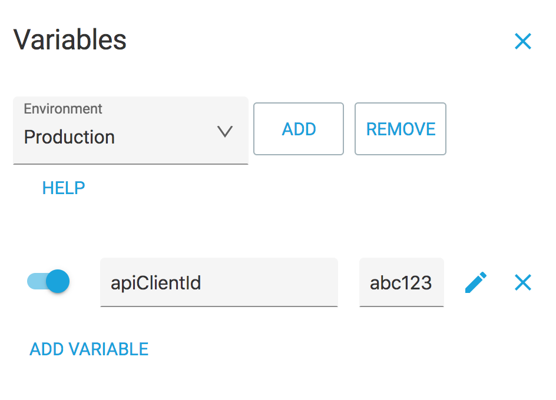

# Environments and variables

## Variables overview

Variables are used in all request fields \(method, URL, headers, body\) and allow to define a value in a global scope that is inserted in place when making a request.

Environments are the way of organizing variables into a namespace. It allows to switch between different sets of variables. It can be used to define variables for different context like staging and production.

Let's say you have "production" and "stage" environments for your API. Both are using different authorization keys. Environments and variables are made to manage situation like this. Let's say you API support `x-client-id` header with some value that is used to recognize the client. Because of the separation of the environments you have to use different keys for both environments. To deal with this create two environments for "production" and "stage" and create `apiClientId` variable with corresponding values. You can use the variable as `${apiClientId}` in the headers editor as a value. The value is automatically added to the headers before sending the request to the server. 

## Listing variables

Advanced REST Client lists your application variables created for current environment and system variables available on your machine. You can use both keys to insert it into a request.

To protect your data variables are masked by default. You can toggle visibility of the values using the button at the bottom of the variables list.


You can disable application or system variables in application settings.


When switching the environment in the top toolbar you will switch between different application variables defined for this environment. System variables cannot be changed.

## Editing variables

To add a new environment first click on "Edit variables" to open variables editor.

Then "Add" next to environment selector. It then renders a text field where you can enter new environment name. There are no limitation for environment name.

When the environment is saved then you can define variables for it.

You can disable a variable by toggling it on the left-hand side of the input field.


Variable name must start with a letter and only contain letters and numbers. Special characters or national accents are not supported.



Variable value is always visible in the editor mode.



Variable value can be any value, even another variable.


You can repeat this steps as many times you need for each of your environments. After your variables are defined you can use them in the editors.

## Applying variables

To apply a variable simply as `${` before variable name and `}` after it.

The value is applied to the header just before sending the request

You can put a variable into a method, URL, headers, or payload field. Variables can be used as many times as you need in a request.

## Composite variables

Variable's value can use another variable. This variables makes it easier to build variables that requires values from multiple sources.

As an example, basic authorization requires both username and password. It might be difficult to maintain credentials in multiple requests. It's a better idea to store both the username and the password as a separate variables and create new one that combines both with some additional value.

As a result the combined value is used with the request.

## Functions in variables

You can use one of the predefined functions in your variables. The ARC's engine support various String, Math, and other functions. To run a function editor press a pencil icon next to variable value text field. It brings editor popup with available options with configuration.

It uses JavaScript envine to evaluate the value. We will use a `slice` function from `String` class to demonstrate the principle. The `slice` function accepts two arguments start and end, and returns a string that contains characters found between start index and end index. We are going to "slice" our `${username}` variable to get a string from position 1 to 3. We would use the following syntax: `String.slice(${username}, 1, 3)` where the first argument is the string we are operating on and other arguments are arguments passed to the JavaScript function.

In a programming world this would JavaScript would evaluate: `"uname".slice(1, 3)` which in result returns `na`.

### Function execution group

ARC support few additional functions. They are defined in miscellaneous tab. The the moment you can choose between `now` `random` `decodeURIComponent` and `encodeURIComponent` functions.

Now and random functions support grouping that allows you to generate a value once when making a request and to reuse generated value again using the same group name. Pass a value to either of the functions as an argument and re-use the same function call more than once to recol generated value.

