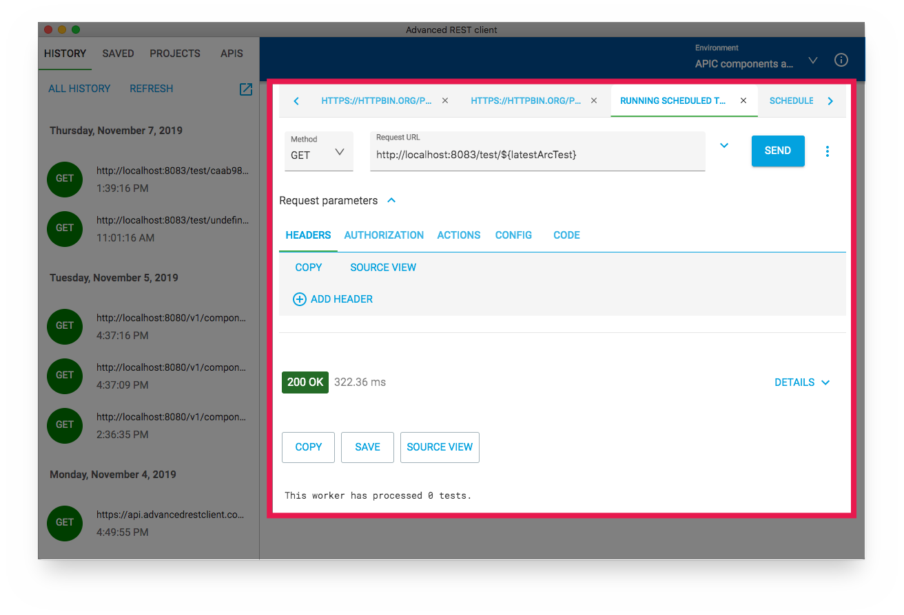

# Workspaces

## Introducing workspaces


Workspaces are available in ARC 14 and above


A workspace is the current state of the request editors opened in the application.

Every time a request property is changed or a response is ready a new state is stored by the application automatically in a file. Request property can be the method, URL, headers, or the payload but also Actions and request configuration.

Historically this data was stored in a file in application home directory. Now, however, you have an option to save the workspace state to some other file you select. This file can be later opened by ARC and it restores the same sate.

## Why to use workspaces?

When you creating a tutorial or a documentation for your API you can create a workspace that contains all required configuration to run requests one-by-one. You can design the workspace as each tab represent next step in your tutorial. The workspace also contains configuration data like variables and application configuration that should be applied to a request when executing it.

## Using workspaces

### Prepare your workspace

To start with a workspace just create a sequence of requests you want to share with your audience. It's just like regular use of ARC. You can design request actions and configure request behavior in the corresponding tabs of the request editor.

If you make a request and the response is ready then the response is also added to the current state.


ARC 14 does not allow to define workspace variables in application interface. Variables can be added by editing generated file.


When ready go to Workspace menu and select Open workspace details.

This opens a dialog that shows workspace metadata like description, version, and author information. Don't worry about not having any data just yet.

The workspace details are for the target audience that gives additional context to the data included into the workspace. Remember, however, that this step is optional.

Go ahead and click "Edit" button. It opens workspace details editor that allows you to enter the corresponding values. All input fields are optional.


The description field supports markdown.


After filling the form the preview shows updated information instead "No data".

### Saving the workspace

From the _Workspace_ menu select _Save as..._ option.

This opens a regular save dialog. Select a location where the file should be stored.

That's it. The workspace is now stored in the file you have requested.

When you open the file you will see it's just a JSON file with a representation of the state:

You can change any of the properties in the JSON if needed. However if you make any change in the application UI the state is automatically stored to the file, unless you open other workspace file.

### Opening workspace file

From the _Workspace_ menu select _Open from file_ option.

This opens new ARC window with the same state as stored when the file was saved.

